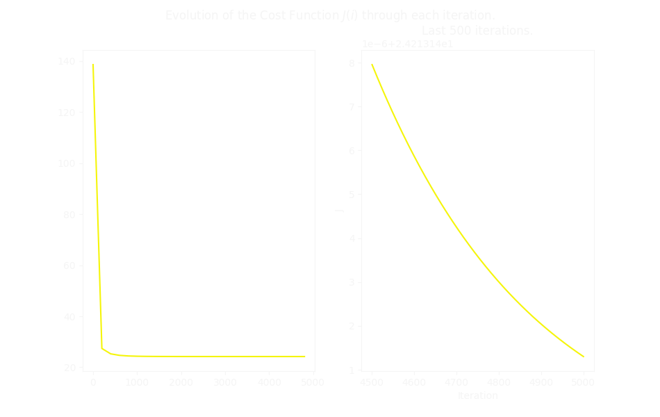
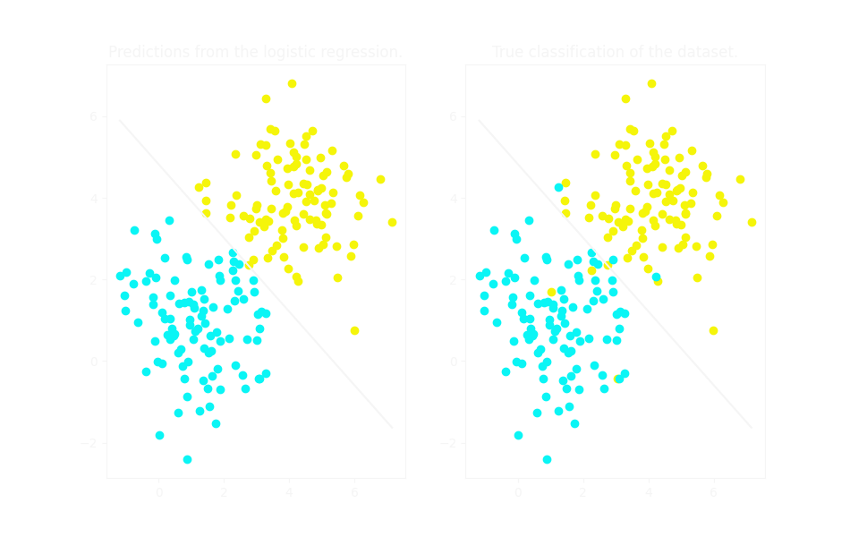
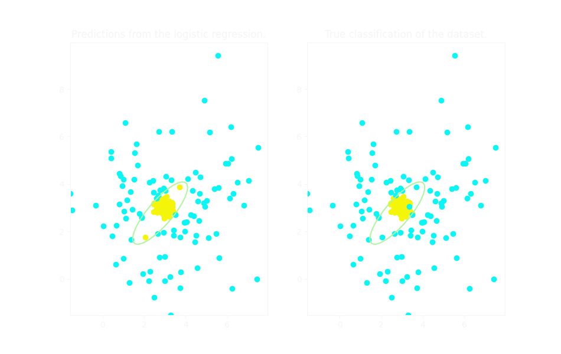

# Supervised learning implementation

Fernando Borrero Granell

### Index:

* [Introduction](#section1)
* [Materials](#section2)
* [Methods](#section3)
* [Results](#section7)
* [License](#section11)

### Introduction

In this side project I am creating from scratch an implementation of linear regression & logistic regression, two pillars of machine learning, without the help of machine learning libraries. 

### Materials

I will be using **Numpy**'s library to be able to vectorize the computations and make them more efficient. To be able to plot some graphics I will also be using **Matplotlib**.

### Methods
Linear regression and logistic regression consists on finding the optimal parameters $\vec{w},b$ such as that the cost function is minimal. Hence, all we have to do is solve an optimization problem.

In **linear regression**, the most typical cost function used in data analysis is the **Squared error** equal to $$J(\vec{w},b)=\frac{1}{2m}\sum_{i=1}^m(f_{\vec{w},b}(\vec{x}^{(i)})-y^{(i)})^2$$ where $f_{\vec{w},b}(\vec{x}^{(i)})$ is the prediction of our model for the sample $\vec{x}^{(i)}$. 

In **logistic regression** our prediction $f_{\vec{w},b}(\vec{x}^{(i)})$ is a bit different since it involves the sigmoid $g(z)=(1+\exp(-z))^{-1}$. This forces us to change our cost function to make the algorithm efficient:
$$J (\vec{w},b) = -\frac{1}{m} \sum_{i=1}^m [y^{(i)}\log(f_{\vec{w},b}(\vec{x}^{(i)}))+(1-y^{(i)})\log(1-f_{\vec{w},b}(\vec{x}^{(i)}))]$$

In **both cases** we will be using **Gradient descent**: an algorithm that works by driving the parameters into the opposite direction of the gradient (i.e. the direction of steepest descent for that point). When computing the gradient (partial derivates), both cost functions result in the same expressions in terms of $f_{\vec{w},b}(\vec{x}^{(i)})$. Thus the algorithm will update the parameters in each iteration according to:
$$w \rightarrow w-\alpha \frac{1}{m}\sum_{i=1}^{m}(f_{w,b}(\vec{x}^{(i)})-y^{(i)})x^{(i)}$$
$$b \rightarrow b-\alpha\frac{1}{m}\sum_{i=1}^{m}(f_{w,b}(\vec{x}^{(i)})-y^{(i)})$$
Since we're always moving in the gradient direction, we should expect the cost function to decrease in each iteration (given that the learning rate $\alpha$ is correctly chosen).

### Results

In all test examples I found that the cost function decreases in every iteration, as we expeceted. All examples followed this pattern:

The optimal parameters found are equal or very close to the ideal parameters for each example:
- Linear regression: **Test 1**
    - The ideal solution is w = 2, b = 10.00
    - The solution found is w = 2.01, b = 9.80
- Linear regression: **Test 2**
    - The ideal solution is w = 37, b = -20.00
    - The solution found is w = 36.98, b = -19.56
- Linear regression: **Test 3**
    - The ideal solution is w = [5 -5], b = -10.00
    - The solution found is w = [5 -5], b = -10.00

We can visually see that the parameters found for the logistic regression work aswell
- Logistic regression: **Test 1**

- Logistic regression: **Test 2**

### License
This is an educational project; therefore, all materials can be used freelly.
